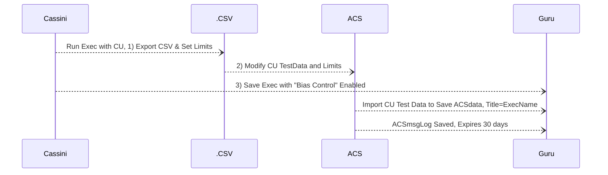
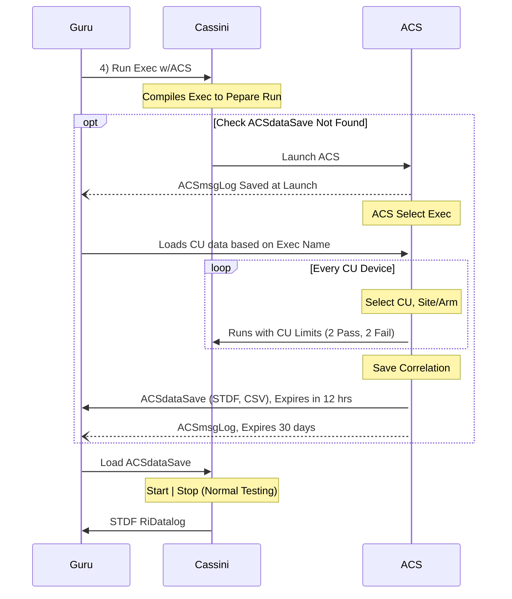
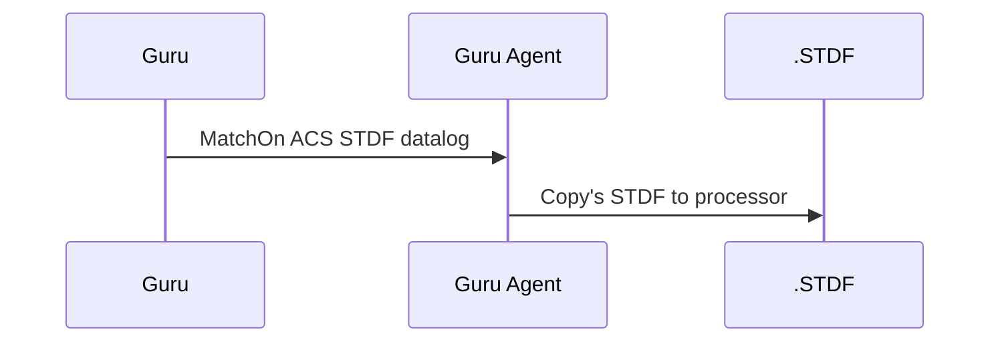

# Auto Correlation System (ACS)

## Intro

ACS compares Control Unit (CU) per Cassini Test Exec to validate setup prior to production lot testing.  CU Data is collected, exported as CSV and limits manipulated (offline) for each test.

## Sequence Diagrams

### Setup (Steps 1-3)

### Run (Step 4)

### Copy STDF Datalog

